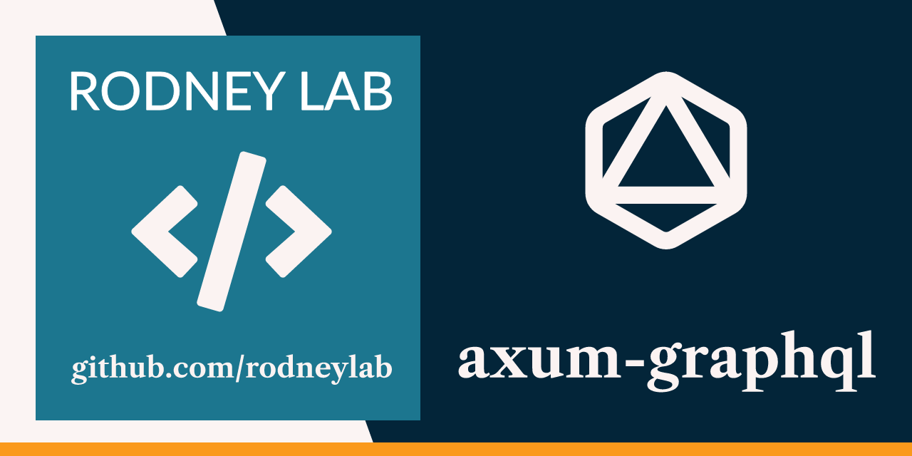
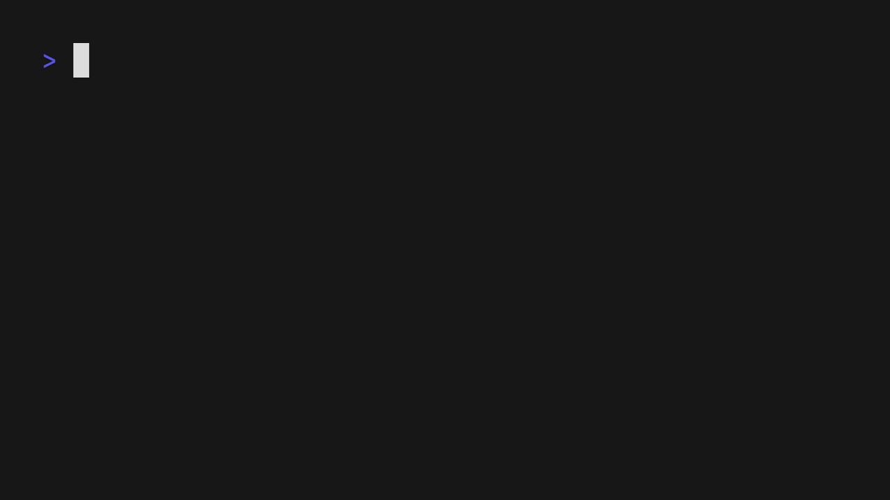

<p align="center">
  <a aria-label="Open Rodney Lab site" href="https://rodneylab.com" rel="nofollow no:w
  opener noreferrer">
    
  </a>
</p>
<h1 align="center">
  axum-graphql
</h1>

**Rust GraphQL demo/test API written in Rust, using Axum for routing, async-graphql and SQLx.**

APIs are minimal and represent a blog site back-end, with GraphQL queries to create and delete draft posts, as well as, publish them.

The app includes tracing, using OpenTelemetry, with data pushed to a [Jaeger Collector](https://www.jaegertracing.io/docs/1.62/deployment/#collectors) using the OpenTelemetry Protocol (**OTLP**). Metrics are also included, using Prometheus.

Based on [How to Build a Powerful GraphQL API with Rust by Oliver Jumpertz](https://oliverjumpertz.com/blog/how-to-build-a-powerful-graphql-api-with-rust/), updated to use Axum 0.8 and generate an OTLP tracing stream, instead of the Jaeger HTTP format (Jaeger collector is still kept).

## Spinning up the app



1. Clone this repo and change into the new directory.

2. Start the observability services with docker-compose:

```shell
docker compose up -d
```

3. Start the app with `cargo run`. The app will create the SQLite database file and run database migrations in the `migrations` directory.

4. Open a browser window at `http://localhost:8000` to bring up the GraphQL Playground and run some queries.

5. The observability services might take a few moments to spin up, and in this case you will see Terminal output:

```shell
OpenTelemetry trace error occurred. Exporter otlp encountered the following error(s): the grpc server returns error (The service is currently unavailable): , detailed error message: tcp connect error: Connection refused (os error 61)
```

This should be temporary.

### SQLite Database

The project database migrations create an SQLite database with a Post table,
which has id, title,body and published fields. You can run GraphQL queries to
create, read, update and delete from this table.


### Example queries:

- Hello world:

```graphql
query HelloQuery {
  hello
}
```

- Create a draft:

```graphql
mutation CreateDraftMutation {
  createDraft(title: "Post working title", body: "Draft body text") {
    id
    title
  }
}
```

- Delete a draft:

```graphql
mutation DeleteDraftMutation {
  deleteDraft(id: 1) {
    __typename
    ... on DeleteDraftSuccessResponse {
      post {
        id
        title
      }
    }
    ... on DeleteDraftErrorResponse {
      error {
        field
        message
        received
      }
    }
  }
}
```

- List existing drafts:

```graphql
query DraftsQuery {
  drafts {
    id
    title
  }
}
```

## App and Observability Endpoints

GraphQL Playground: http://localhost:8000/

Metrics raw output: http://localhost:8001/metrics

Jaeger Query UI: http://localhost:16686/search

## What's inside?

### tracing

The tracing service is provided via a Jaeger Collector, Jaeger Query UI and a [Cassandra database](https://cassandra.apache.org/_/index.html), all running in Docker, and configured in [`docker-compose.yml`](./docker-compose.yml). The jaeger-all-in-one image has now been deprecated, as well as `jaeger-agent`. `jaeger-all-in-one` supported in-memory storage, and this is not supported by `jaeger-collector`. Instead, you need to create a Cassandra (or [Elasticsearch](https://hub.docker.com/_/elasticsearch/)) database to store traces.

### SQLite Database

The API uses an SQLite single-file database for simplicity, at [`sqlite.db`](./sqlite.db). This is automatically created (if it does not yet exist) when the app spins up.

## Why did I create this?

The repo is just intended as a reference to speed up creating am Axum-based GraphQL API with observability features.

## What this is not

- A production ready app
- Guide to using Axum, async-graphql or SQLx that covers every feature.
  - To learn more about async-graphql, see:
    - the [async-graphql docs](https://docs.rs/async-graphql/latest/async_graphql/);
    - [async-graphql examples](https://github.com/async-graphql/examples); and
    - [async-graphql book](https://async-graphql.github.io/async-graphql/en/index.html).
  - Axum also has great resource, including:
    - [axum docs](https://docs.rs/axum/latest/axum/); and
    - [axum examples](https://github.com/tokio-rs/axum/tree/main/examples).
  - For SQLx resources, see:
    - [SQLx docs](https://docs.rs/sqlx/latest/sqlx/);
    - [SQLx examples](https://github.com/launchbadge/sqlx/tree/main/examples); and
    - [Rust SQLx basics with SQLite: super easy how-to](https://tms-dev-blog.com/rust-sqlx-basics-with-sqlite/).
  - For a general introduction to building an web-based API in Rust, [Zero to Production in Rust](https://www.zero2prod.com/index.html) is marvellous.

## ☎️ Issues

Feel free to jump into the [Rodney Lab matrix chat room](https://matrix.to/#/%23rodney:matrix.org).
