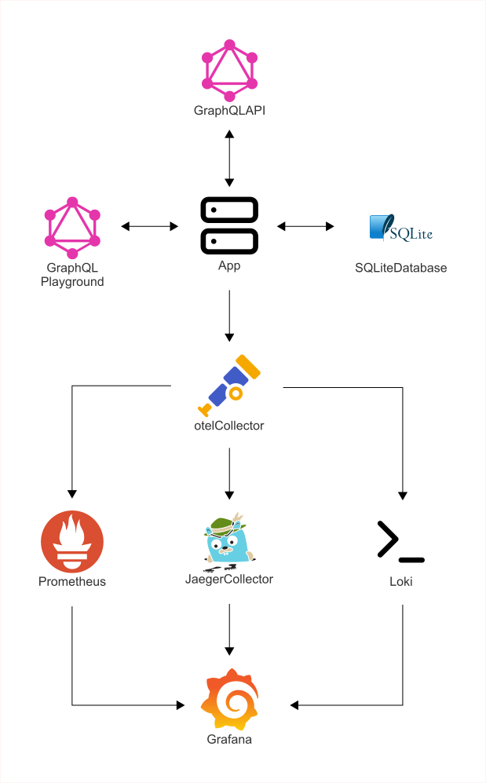

<p align="center">
  <a aria-label="Open Rodney Lab site" href="https://rodneylab.com" rel="nofollow no:w
  opener noreferrer">
    
  </a>
</p>
<h1 align="center">
  axum-graphql
</h1>

[](https://codecov.io/gh/rodneylab/axum-graphql)

## Introduction

**Rust GraphQL demo/test API written in Rust, using Axum for routing, async-graphql and SQLx.**

For Rust developers building a GraphQL API, considering using Axum and
async-graphql.

APIs are minimal and represent a blog site back-end, with GraphQL queries to
create and delete draft posts, as well as, publish them.

The app is based on [How to Build a Powerful GraphQL API with Rust by Oliver Jumpertz](#acknowledgements), updated to use Axum 0.8. It also
has more extensive observability, implemented using OpenTelemetry. Data are
pushed from the app to an OpenTelemetry collector, which in turn:

- has a Prometheus metrics endpoint;
- pushes traces to a Jaeger collector, which exposes a Jaeger Query UI endpoint;
  and
- exports logs to a Loki endpoint.

OpenTelemetry collector, Prometheus, Jaeger Collector, Jaeger Query and Loki all
get spun up via [`docker-compose`](./docker-compose.yml). Additionally, the
docker-compose configuration initialises a Grafana session (collecting all
previously mentioned observability components into a single interface).



## Contents

- [Introduction](#introduction)
- [Spinning up the app](#spinning-up-the-app)
  - [Prerequisites](#prerequisites)
  - [Running the app](#running-the-app)
- [App and Observability Endpoints](#app-and-observability-endpoints)
- [What’s inside?](#whats-inside)
  - [Tracing](#tracing)
  - [SQLite Database](#sqlite-database)
- [Why did I create this?](#why-did-i-create-this)
- [What this is not](#what-this-is-not)
- [Issues and Support](#️-issues-and-support)
- [Contributions](#contributions)
- [Acknowledgements](#acknowledgements)
- [License](#license)

## Spinning up the app

### Prerequisites

Requires:

- Rust 1.86 toolchain or newer; and
- docker-compose.


1. Clone this repo and change into the new directory.

2. Start the observability services with docker-compose:

### Running the app

```shell
docker compose up -d
```

3. Start the app with `cargo run`. The app will create the SQLite database file
   and run database migrations in the `migrations` directory.

4. Open a browser window at `http://localhost:8000` to bring up the GraphQL
   Playground and run some queries.

5. The observability services might take a few moments to spin up, and in this
   case you will see Terminal output:

```shell
OpenTelemetry trace error occurred. Exporter otlp encountered the following error(s): the grpc server returns error (The service is currently unavailable): , detailed error message: tcp connect error: Connection refused (os error 61)
```

This should be temporary.

#### SQLite Database

The project database migrations create an SQLite database with a Post table,
which has `id`, `title`, `body` and `published` fields. You can run GraphQL
queries to create, read, update and delete from this table.


#### Example queries:

- Hello world:

```graphql
query HelloQuery {
  hello
}
```

- Create a draft:

```graphql
mutation CreateDraftMutation {
  createDraft(title: "Post working title", body: "Draft body text") {
    id
    title
  }
}
```

- Delete a draft:

```graphql
mutation DeleteDraftMutation {
  deleteDraft(id: 1) {
    __typename
    ... on DeleteDraftSuccessResponse {
      post {
        id
        title
      }
    }
    ... on DeleteDraftErrorResponse {
      error {
        field
        message
        received
      }
    }
  }
}
```

- List existing drafts:

```graphql
query DraftsQuery {
  drafts {
    id
    title
  }
}
```

## App and Observability Endpoints

GraphQL Playground: http://localhost:8000/

Metrics raw output: http://localhost:8889/metrics

Jaeger Query UI: http://localhost:16686/search

Grafana: http://localhost:3000/

## What's inside?

### tracing

The tracing service is provided via the OpenTelemetry Collector, Jaeger Query UI
and a [Cassandra database](https://cassandra.apache.org/_/index.html), all
running in Docker. Docker also spins up a Cassandra database for storing traces.

### SQLite Database

The API uses an SQLite single-file database for simplicity, at
[`sqlite.db`](./sqlite.db). This is automatically created (if it does not yet
exist) when the app spins up.

## Why did I create this?

The repo is just intended as a reference to speed up creating am Axum-based
GraphQL API with observability features.

## What this is not

- A production-ready app.
- Guide to using Axum, async-graphql or SQLx that covers every feature.
  - To learn more about async-graphql, see:
    - the [async-graphql docs](https://docs.rs/async-graphql/latest/async_graphql/);
    - [async-graphql examples](https://github.com/async-graphql/examples); and
    - [async-graphql book](https://async-graphql.github.io/async-graphql/en/index.html).
  - Axum also has great resource, including:
    - [axum docs](https://docs.rs/axum/latest/axum/); and
    - [axum examples](https://github.com/tokio-rs/axum/tree/main/examples).
  - For SQLx resources, see:
    - [SQLx docs](https://docs.rs/sqlx/latest/sqlx/);
    - [SQLx examples](https://github.com/launchbadge/sqlx/tree/main/examples); and
    - [Rust SQLx basics with SQLite: super easy how-to](https://tms-dev-blog.com/rust-sqlx-basics-with-sqlite/).
  - For a general introduction to building a web-based API in Rust, [Zero to Production in Rust](https://www.zero2prod.com/index.html) is marvellous.

## ☎️ Issues and Support

Open an issue if something does not work as expected or if you have some
improvements.

Feel free to jump into the
[Rodney Lab matrix chat room](https://matrix.to/#/%23rodney:matrix.org).

## Contributions

Contributions welcome, write a short issue with your idea, before spending to
much time on more involved additions.

### Contributing guidelines

- Before working on a new feature it's preferable to submit a feature request first and state that you'd like to implement it yourself
- Please don't submit PRs for feature requests that are either in the roadmap<sup>[1]</sup>, backlog<sup>[2]</sup> or icebox<sup>[3]</sup>
- Avoid introducing new dependencies
- Avoid making backwards-incompatible configuration changes

<details>
<summary><strong><sup>[1] [2] [3]</sup></strong></summary>

[1] The feature likely already has work put into it that may conflict with your implementation

[2] The demand, implementation or functionality for this feature is not yet clear

[3] No plans to add this feature for the time being

</details>

## Acknowledgements

Inspired by:

- [Zero to Production in Rust](https://www.zero2prod.com/index.html); and
- [How to Build a Powerful GraphQL API with Rust by Oliver Jumpertz](https://oliverjumpertz.com/blog/how-to-build-a-powerful-graphql-api-with-rust/).

## License

The project is released under the BSD 3-Clause License — see the [LICENSE](./LICENSE) file for details.
